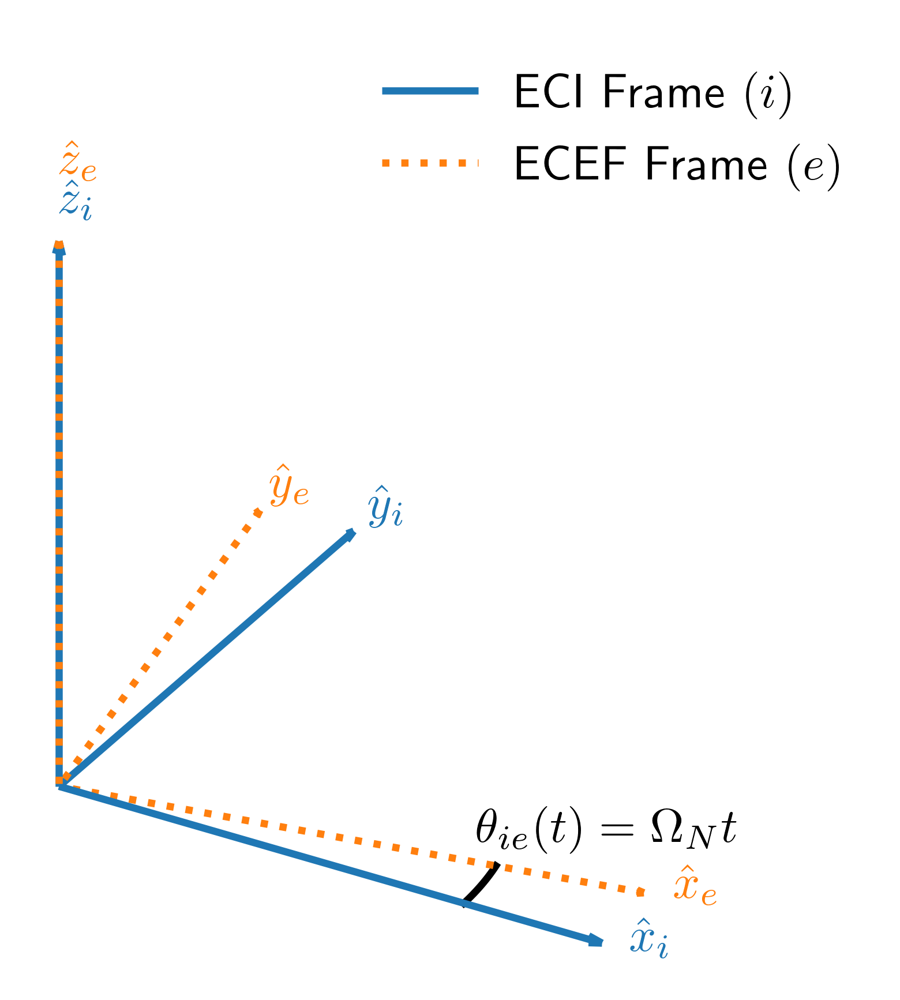

*****************
Coordinate Frames
*****************

Frame Types
===========
There are five types of reference frames:

    1. Inertial
    2. Fixed
    3. Translocating
    4. Rotating
    5. Six degree of freedom (DOF)

An inertial frame is the highest possible reference frame and therefore does not have an offset or an attitude relative to another frame. All lower reference frames relate to the inertial frame through the hierarchy of reference frames.

Fixed frames do not move relative to the next higher frame in the hierarchy, therefore, a fixed frame has a constant offset :math:`(\boldsymbol{r})` and a constant attitude :math:`(\boldsymbol{\theta})`.

.. math::
    \begin{align}
        \boldsymbol{r}^\mathrm{a}_\mathrm{ab} &= \begin{bmatrix}r^a_{ab_x}\\r^a_{ab_y}\\r^a_{ab_z}\end{bmatrix}
        &\boldsymbol{v}^\mathrm{a}_\mathrm{ab} &= 0
        &\boldsymbol{a}^\mathrm{a}_\mathrm{ab} &= 0\\[0.5em]
        \boldsymbol{\theta}^\mathrm{a}_\mathrm{ab} &= \begin{bmatrix}\theta^a_{ab_x}\\\theta^a_{ab_y}\\\theta^a_{ab_z}\end{bmatrix}
        &\boldsymbol{\omega}^\mathrm{a}_\mathrm{ab} &= 0
        &\boldsymbol{\dot{\omega}}^\mathrm{a}_\mathrm{ab} &= 0
    \end{align}

Translocating frames are 3 DOF frames and only move linearly relative to the next higher frame in the hierarchy. They have a time dependent offset and a constant attitude.

.. math::
    \boldsymbol{r}^\mathrm{a}_\mathrm{ab}(t) = \begin{bmatrix}r^a_{ab_x}\\[0.5em] r^a_{ab_y}\\[0.5em] r^a_{ab_z}\end{bmatrix}(t) \quad\quad\quad \boldsymbol{v}^\mathrm{a}_\mathrm{ab}(t) = \begin{bmatrix}\dot{r}^a_{ab_x}\\[0.5em] \dot{r}^a_{ab_y}\\[0.5em] \dot{r}^a_{ab_z}\end{bmatrix}(t) \quad\quad\quad \boldsymbol{a}^\mathrm{a}_\mathrm{ab}(t) = \begin{bmatrix}\ddot{r}^a_{ab_x}\\[0.5em] \ddot{r}^a_{ab_y}\\[0.5em] \ddot{r}^a_{ab_z}\end{bmatrix}(t)

Rotating frames are also 3 DOF frames and only rotate relative to the next higher frame in the hierarchy. They have a constant offset and a time dependent attitude.

.. math::
    \boldsymbol{\theta}^\mathrm{a}_\mathrm{ab}(t) = \begin{bmatrix}\theta^a_{ab_x}\\[0.5em] \theta^a_{ab_y}\\[0.5em] \theta^a_{ab_z}\end{bmatrix}(t) \quad\quad\quad \boldsymbol{\omega}^\mathrm{a}_\mathrm{ab}(t) = \begin{bmatrix}\dot{\theta}^a_{ab_x}\\[0.5em] \dot{\theta}^a_{ab_y}\\[0.5em] \dot{\theta}^a_{ab_z}\end{bmatrix}(t) \quad\quad\quad \boldsymbol{\dot{\omega}}^\mathrm{a}_\mathrm{ab}(t) = \begin{bmatrix}\ddot{\theta}^a_{ab_x}\\[0.5em] \ddot{\theta}^a_{ab_y}\\[0.5em] \ddot{\theta}^a_{ab_z}\end{bmatrix}(t)

Six DOF frames move linearly and rotate relative to the next higher frame in the hierarchy. They have both a time dependent offset and time dependent attitude.

Testbed Frames
==============
A rotational testbed has a hierarchy of :math:`5+3A` reference frames, which are used in the development of the forward model. :math:`A` is the total number of testbed rotational axes. Examples of the number of rotational axes are:

- Basic centrifuge, or single axis rate table :math:`\rightarrow A = 1`
- Centrifuge with counter-rotating platform, or dual axis rate table :math:`\rightarrow A = 2`
- Centrifuge with two-axis platform, or three axis rate table :math:`\rightarrow A = 3`

We will assume that the rotational testbed is located on Earth as this is the most common setup. If the testbed is not located on Earth, then the highest three frames will require redefinition.

Inertial Frame
--------------
The inertial frame in the hierarchy is the Earth Centered Inertial (ECI) frame :math:`(\mathrm{i})`. The frame origin is located at the center of the Earth and the z-axis points along the Earth's rotation vector (i.e., towards the North pole). The x and y axes are fixed in inertial space. See :cite:p:`2013:groves` for further details.

Earth Frame
-----------
The next frame is the Earth Centered Earth Fixed (ECEF) frame :math:`(\mathrm{e})`. Contrary to the name, the :math:`\mathrm{e}` frame is a rotating frame and rotates relative to the :math:`\mathrm{i}` frame. The frame origin is located at the center of the Earth, the x-axis points through the equator at the prime meridian (i.e., latitude 0°, longitude 0°), the z-axis points along the Earth's rotation vector, and the y-axis completes the right hand, orthogonal coordinate frame. See :cite:p:`2013:groves` for further details. The :math:`\mathrm{e}` frame parameters are:

.. math::
    \boldsymbol{r}^\mathrm{i}_{\mathrm{i}\mathrm{e}} = \begin{bmatrix}0\\[0.5em] 0\\[0.5em] 0\end{bmatrix} \quad \quad \boldsymbol{\theta}^\mathrm{i}_{\mathrm{i}\mathrm{e}}(t) = \begin{bmatrix}0\\[0.5em] 0\\[0.5em] \theta_{\mathrm{i}\mathrm{e}}(t) = \Omega_\mathrm{N} t \end{bmatrix} \quad \quad \boldsymbol{\omega}^\mathrm{i}_{\mathrm{i}\mathrm{e}} = \begin{bmatrix}0\\[0.5em] 0\\[0.5em] \Omega_\mathrm{N}\end{bmatrix} \quad \quad \dot{\boldsymbol{\omega}}^\mathrm{i}_{\mathrm{i}\mathrm{e}} = \begin{bmatrix}0\\[0.5em] 0\\[0.5em] 0\end{bmatrix}

where :math:`\Omega_\mathrm{N} = 72.921151467064\; \mu rad/s` :cite:p:`2023:poiersc`. The relationship of the :math:`\mathrm{e}` frame to the :math:`\mathrm{i}` frame is shown in Figure 1.

    **Figure 1. Relationship of ECEF Frame to ECI Frame**

Local Navigation Frame
----------------------
After the e frame is the local navigation frame :math:`(\mathrm{n})`, which positions the testbed on Earth. The :math:`\mathrm{n}` frame is a fixed frame. The origin is located at or near the testbed depending on the capabilities of a location/gravity survey. The x-axis points toward the North pole, the z-axis points down along the local plumb bob gravity vector, and the y-axis completes the right hand, orthogonal coordinate frame. See :cite:p:`2013:groves` for further details. The :math:`\mathrm{n}` frame parameters are:

.. math::
    \boldsymbol{r}^\mathrm{e}_{\mathrm{e}\mathrm{n}} = \begin{bmatrix} \left(M_\varphi+h\right)\cos\varphi\cos\lambda\\[0.5em] \left(M_\varphi+h\right)\cos\varphi\sin\lambda\\[0.5em] \left[M_\varphi\left(1-e^2\right)+h\right]\sin\varphi \end{bmatrix} \quad \quad \boldsymbol{\theta}^\mathrm{e}_{\mathrm{e}\mathrm{n}} = \begin{bmatrix}0\\[0.5em] -(\pi/2 + \varphi)\\[0.5em] \lambda\end{bmatrix}

where

    - :math:`\varphi` is the latitude of the testbed, rad
    - :math:`\lambda` is the longitude of the testbed, rad
    - :math:`h` is the height of the testbed above the ellipsoid, m
    - :math:`M_\varphi` is the meridional radius of curvature at :math:`\varphi` :math:`\left(M_\varphi = \dfrac{\mathrm{a}}{\sqrt{1-e^2\sin^2\varphi}}\right)`
    - :math:`\mathrm{a}` is the semi-major axis of the ellipsoid (:math:`\mathrm{a} = 6378137.0` m, WGS84)
    - :math:`e` is the first eccentricity of the ellipsoid (:math:`e^2 = 2f-f^2`)
    - :math:`f` is the flattening of the ellipsoid (:math:`f = 1/298.257223563`, WGS84)

An example relationship of the :math:`\mathrm{n}` frame to the :math:`\mathrm{e}` frame is shown in Figure 2.

    **Figure 2. Relationship of Nav Frame to ECEF Frame**

Testbed Axes
------------
The testbed axes come next in the hierarchy starting with the outermost axis (:math:`A`) and progressing down to the innermost axis (1). For each axis :math:`(a=A\dots1)` there are three internal reference frames.

Zero Frame
^^^^^^^^^^^
A zero (:code:`zero`) frame :math:`(\zeta_a)` is the highest frame in each testbed axis and relates a perfectly aligned axis in the 'zero' position to the next higher frame :math:`\left(\mathrm{h}\right)`. Each zero frame is a fixed frame and is positioned such that the frame's z-axis aligns with the ideal rotation axis for the corresponding testbed axis. For each zero frame: :math:`\mathrm{h} = \mathrm{n}` when :math:`a = A`, and :math:`\mathrm{h} = \rho_{a+1}` when :math:`a < A`. The :math:`\zeta_a` frame parameters are:

.. math::
    \boldsymbol{r}^\mathrm{h}_{\mathrm{h}{\zeta_a}} = \begin{bmatrix}x^\mathrm{h}_{\mathrm{h}{\zeta_a}} \\[0.5em] y^\mathrm{h}_{\mathrm{h}{\zeta_a}} \\[0.5em] z^\mathrm{h}_{\mathrm{h}{\zeta_a}} \end{bmatrix} \quad \quad \boldsymbol{\theta}^\mathrm{h}_{\mathrm{h}{\zeta_a}} = \begin{bmatrix} \alpha^\mathrm{h}_{\mathrm{h}{\zeta_a}} \\[0.5em] \beta^\mathrm{h}_{\mathrm{h}{\zeta_a}} \\[0.5em] \gamma^\mathrm{h}_{\mathrm{h}{\zeta_a}} \end{bmatrix}

The :math:`\zeta_A` to :math:`\mathrm{n}` offset :math:`\left(\boldsymbol{r}^\mathrm{n}_{\mathrm{n}{\zeta_A}}\right)` is typically zero but may be non-zero to account for site surveys being unable to collocate the :math:`\mathrm{n}` and :math:`\zeta_A` origins. The :math:`\zeta_a` to :math:`\rho_{a+1}` offsets :math:`\left(\boldsymbol{r}^{\rho_{a+1}}_{{\rho_{a+1}}{\zeta_a}}\right)` of testbed axes :math:`a < A` are dependent on the mechanical design of the testbed.

Misalignment Frame
^^^^^^^^^^^^^^^^^^
A misalignment (:code:`msln`) frame :math:`(\mu_a)` of each axis follows the corresponding :math:`\zeta_a` frame and applies testbed errors to the axis. The :math:`\mu_a` frames are 6 DOF frames to allow for testbed error accounting. The :math:`\mu_a` frame parameters are:

.. math::
    \boldsymbol{r}^{\zeta_a}_{{\zeta_a}{\mu_a}}(t) = \begin{bmatrix}x^{\zeta_a}_{{\zeta_a}{\mu_a}}\\ y^{\zeta_a}_{{\zeta_a}{\mu_a}} \\ z^{\zeta_a}_{{\zeta_a}{\mu_a}}\end{bmatrix}(t) \quad\quad\quad \boldsymbol{v}^{\zeta_a}_{{\zeta_a}{\mu_a}}(t) = \begin{bmatrix}\dot{x}^{\zeta_a}_{{\zeta_a}{\mu_a}}\\ \dot{y}^{\zeta_a}_{{\zeta_a}{\mu_a}} \\ \dot{z}^{\zeta_a}_{{\zeta_a}{\mu_a}}\end{bmatrix}(t) \quad\quad\quad \boldsymbol{a}^{\zeta_a}_{{\zeta_a}{\mu_a}}(t) = \begin{bmatrix}\ddot{x}^{\zeta_a}_{{\zeta_a}{\mu_a}}\\ \ddot{y}^{\zeta_a}_{{\zeta_a}{\mu_a}} \\ \ddot{z}^{\zeta_a}_{{\zeta_a}{\mu_a}}\end{bmatrix}(t)\\

.. math::
    \boldsymbol{\theta}^{\zeta_a}_{{\zeta_a}{\mu_a}}(t) = \begin{bmatrix}\alpha^{\zeta_a}_{{\zeta_a}{\mu_a}} \\ \beta^{\zeta_a}_{{\zeta_a}{\mu_a}} \\ 0\end{bmatrix}(t) \quad\quad\quad \boldsymbol{\omega}^{\zeta_a}_{{\zeta_a}{\mu_a}}(t) = \begin{bmatrix}\dot{\alpha}^{\zeta_a}_{{\zeta_a}{\mu_a}} \\ \dot{\beta}^{\zeta_a}_{{\zeta_a}{\mu_a}} \\ 0\end{bmatrix}(t) \quad\quad\quad \dot{\boldsymbol{\omega}}^{\zeta_a}_{{\zeta_a}{\mu_a}}(t) = \begin{bmatrix}\ddot{\alpha}^{\zeta_a}_{{\zeta_a}{\mu_a}} \\ \ddot{\beta}^{\zeta_a}_{{\zeta_a}{\mu_a}} \\ 0\end{bmatrix}(t)

The offsets account for testbed machining errors while :math:`\alpha^{\zeta_a}_{{\zeta_a}{\mu_a}}` and :math:`\beta^{\zeta_a}_{{\zeta_a}{\mu_a}}` are small angular misalignments of the testbed axis. The misalignments are time dependent to capture axis precession and coning.

Rotation Frame
^^^^^^^^^^^^^^
The rotation (:code:`rotn`) frames :math:`(\rho_a)` are the lowest of the table axis frames and applies the commanded rotational motion of the axis. They are rotating frames. The :math:`\rho_a` frame parameters are:

.. math::
    \boldsymbol{r}^{\mu_a}_{{\mu_a}{\rho_a}} = \begin{bmatrix}0\\0\\0\end{bmatrix} \quad \quad \boldsymbol{\theta}^{\mu_a}_{{\mu_a}{\rho_a}}(t) = \begin{bmatrix}0\\0\\\gamma^{\mu_a}_{{\mu_a}{\rho_a}}\end{bmatrix}(t) \quad \quad \boldsymbol{\omega}^{\mu_a}_{{\mu_a}{\rho_a}}(t) = \begin{bmatrix}0\\0\\\dot{\gamma}^{\mu_a}_{{\mu_a}{\rho_a}}\end{bmatrix}(t) \quad \quad \dot{\boldsymbol{\omega}}^{\mu_a}_{{\mu_a}{\rho_a}}(t) = \begin{bmatrix}0\\0\\\ddot{\gamma}^{\mu_a}_{{\mu_a}{\rho_a}}\end{bmatrix}(t)

Frame Relationship
^^^^^^^^^^^^^^^^^^
The relationship between the three testbed axis frames is shown in Figure 3. :math:`\alpha` is the misalignment about the x-axis, :math:`\beta` is the misalignment about the y-axis, and :math:`\gamma` is the commanded angle of rotation.

    **Figure 3. Relationship of Testbed Axis Frames**

System Under Test
-----------------
The last two frames in the hierarchy make up the system under test (SUT). They are both fixed frames as the SUT is rigidly affixed to the lowest testbed axis.

Mount Frame
^^^^^^^^^^^
The mount frame :math:`(\mathrm{m})` is coincident with the surface of a mounting plate manufactured to securely attach the SUT to the testbed and relates the mount to the lowest testbed rotation frame :math:`(\rho_1)`. The :math:`\mathrm{m}` frame parameters are:

.. math::
    \boldsymbol{r}^{\rho_1}_{{\rho_1}\mathrm{m}} = \begin{bmatrix}x^{\rho_1}_{{\rho_1}\mathrm{m}}\\ y^{\rho_1}_{{\rho_1}\mathrm{m}} \\ z^{\rho_1}_{{\rho_1}\mathrm{m}}\end{bmatrix} \quad \quad \boldsymbol{\theta}^{\rho_1}_{{\rho_1}\mathrm{m}} = \begin{bmatrix} \alpha^{\rho_1}_{{\rho_1}\mathrm{m}} \\ \beta^{\rho_1}_{{\rho_1}\mathrm{m}} \\ \gamma^{\rho_1}_{{\rho_1}\mathrm{m}} \end{bmatrix}

The mount may be precisely measured to provide accurate :math:`\boldsymbol{r}` and :math:`\boldsymbol{\theta}` values.

Body Frame
^^^^^^^^^^
The body frame :math:`(\mathrm{b})` relates the SUT center of percussion to the mount as designed by the SUT manufacturer. The :math:`\mathrm{b}` frame parameters are:

.. math::
    \boldsymbol{r}^\mathrm{m}_{\mathrm{m}\mathrm{b}} = \begin{bmatrix} x^\mathrm{m}_{\mathrm{m}\mathrm{b}}\\ y^\mathrm{m}_{\mathrm{m}\mathrm{b}} \\ z^\mathrm{m}_{\mathrm{m}\mathrm{b}} \end{bmatrix} \quad \quad \boldsymbol{\theta}^\mathrm{m}_{\mathrm{m}\mathrm{b}} = \begin{bmatrix} \alpha^\mathrm{m}_{\mathrm{m}\mathrm{b}} \\ \beta^\mathrm{m}_{\mathrm{m}\mathrm{b}} \\ \gamma^\mathrm{m}_{\mathrm{m}\mathrm{b}} \end{bmatrix}

The SUT may be precisely measured to provide accurate :math:`\boldsymbol{r}` and :math:`\boldsymbol{\theta}` values. Internal SUT errors are not accounted for in the relational parameters and are left to SUT simulations or compensation algorithms.

Direction Cosine Matrices
=========================
A direction cosine matrix (DCM) relating two reference frames :math:`\left(\mathbf{C}_\mathrm{a}^\mathrm{b}\right)` is a function of the corresponding angular position :math:`\left(\boldsymbol{\theta}^\mathrm{a}_{\mathrm{a}\mathrm{b}}\right)`. If

.. math::
    \boldsymbol{\theta}^\mathrm{a}_{\mathrm{a}\mathrm{b}}(t) = \begin{bmatrix} \alpha \\[0.5em] \beta \\ \gamma \end{bmatrix}(t)

then

.. math::
    \mathbf{C}^\mathrm{a}_\mathrm{b}(t) =
        \begin{bmatrix}
            \cos\beta \cos\gamma &  \sin\alpha \sin\beta \cos\gamma + \cos\alpha \sin\gamma & \sin\alpha \sin\gamma - \cos\alpha \sin\beta \cos\gamma\\[0.75em]
            -\cos\beta \sin\gamma & -\sin\alpha \sin\beta \sin\gamma + \cos\alpha \cos\gamma & \sin\alpha \cos\gamma  + \cos\alpha \sin\beta \sin\gamma\\[0.75em]
            \sin\beta & -\sin\alpha \cos\beta & \cos\alpha \cos\beta
        \end{bmatrix}(t)

where :math:`\mathbf{C}^\mathrm{a}_\mathrm{b}(t)` is formed by performing a rotation about the frame's x-axis :math:`(\alpha)`, followed by a rotation about the new y-axis :math:`(\beta)`, and then a rotation about the new z-axis :math:`(\gamma)`.

Derivatives
-----------
If frame :math:`\mathrm{b}` rotates relative to frame :math:`\mathrm{a}`, then the first derivative of :math:`\mathbf{C}^\mathrm{a}_\mathrm{b}(t)` is computed as:

.. math::
    \dot{\mathbf{C}}^\mathrm{a}_\mathrm{b}(t) = \boldsymbol{\Omega}^\mathrm{a}_{\mathrm{a}\mathrm{b}}(t)\; \mathbf{C}^\mathrm{a}_\mathrm{b}(t)

where :math:`\boldsymbol{\Omega}^\mathrm{a}_{\mathrm{a}\mathrm{b}}(t)` is the skew-symmetric form of the rotation rate vector :math:`\left(\boldsymbol{\omega}^\mathrm{a}_{\mathrm{a}\mathrm{b}}(t)\right)`.

.. math::
    \boldsymbol{\Omega}^\mathrm{a}_{\mathrm{a}\mathrm{b}}(t) = \left[\boldsymbol{\omega}^\mathrm{a}_{\mathrm{a}\mathrm{b}}(t)\right]_\times =
        \begin{bmatrix}
            0 & -\omega^\mathrm{a}_{\mathrm{a}\mathrm{b}3}(t) & \omega^\mathrm{a}_{\mathrm{a}\mathrm{b}2}(t)\\[0.5em]
            \omega^\mathrm{a}_{\mathrm{a}\mathrm{b}3}(t) & 0 & -\omega^\mathrm{a}_{\mathrm{a}\mathrm{b}1}(t)\\[0.5em]
            -\omega^\mathrm{a}_{\mathrm{a}\mathrm{b}2}(t) & \omega^\mathrm{a}_{\mathrm{a}\mathrm{b}1}(t) & 0
        \end{bmatrix}

Applying the product rule allows us to calculate the second derivative of :math:`\mathbf{C}^\mathrm{a}_\mathrm{b}(t)` as:

.. math::
    \begin{align}
        \ddot{\mathbf{C}}^\mathrm{a}_\mathrm{b}(t) &= \dot{\boldsymbol{\Omega}}^\mathrm{a}_{\mathrm{a}\mathrm{b}}(t)\; \mathbf{C}^\mathrm{a}_\mathrm{b}(t) + \boldsymbol{\Omega}^\mathrm{a}_{\mathrm{a}\mathrm{b}}(t)\; \dot{\mathbf{C}}^\mathrm{a}_\mathrm{b}(t)\\
        &= \dot{\boldsymbol{\Omega}}^\mathrm{a}_{\mathrm{a}\mathrm{b}}(t)\; \mathbf{C}^\mathrm{a}_x(t) + \boldsymbol{\Omega}^\mathrm{a}_{\mathrm{a}\mathrm{b}}(t)\; \boldsymbol{\Omega}^\mathrm{a}_{\mathrm{a}\mathrm{b}}(t)\; \mathbf{C}^\mathrm{a}_\mathrm{b}(t)
    \end{align}

**References**

.. bibliography::
